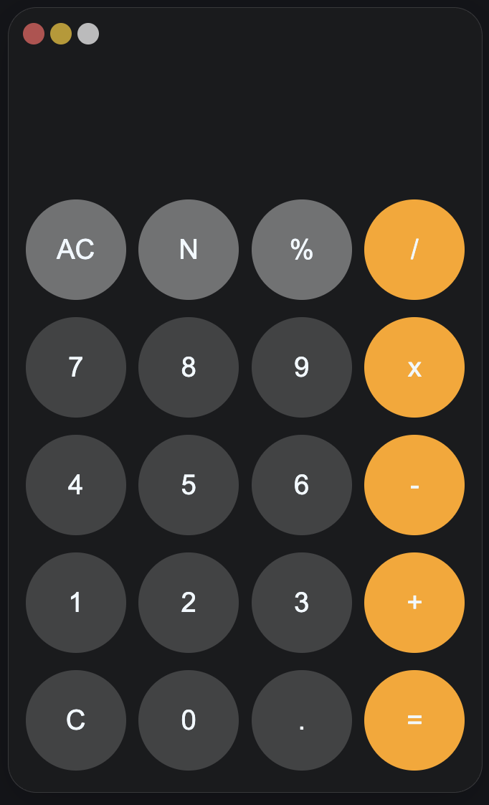

# 🧮 JavaScript Calculator

A simple, modern calculator built with **HTML, CSS, and Vanilla JavaScript**.

It supports basic arithmetic operations, decimals, operator chaining, and dynamic input handling using event delegation.

---

## 🚀 Features

- **Addition (+)**
- **Subtraction (-)**
- **Multiplication (x)**
- **Division (/)**
- **Remainder (%)**
- **Decimal support** (prevents multiple decimals)
- **Operator chaining** (e.g. `5 + 3 - 2`)
- **Clear button**
- **Dynamic display updates**

---

## 🌐 Live Demo

🔗 **[Click here for live demo](https://cuki98.github.io/the-odin-project-calculator/)**

## Application Screenshots

